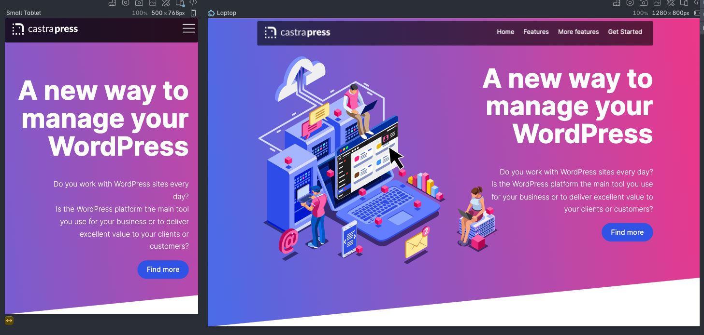

# CI_PP1_CastraPress
This Repo is for project Portfolio 1 as part of Full Stack Developer diploma at CodeInstitue


# CastraPress


## Specialised and managed WordPress hosting company.





## External user’s goals:

Running a WordPress site isn’t that simple or straightforward, despite how WordPress is marketed. It might be easy to create content, but once this content becomes popular you need a decent hosting that is capable of handling a lot of users, swarm of bots and it also needs to be secure to ward off the persistent and relentless hackers. 

Creators, marketers, business owners who are not tech savvy or want to be, wish they had an easy-breezy way to deal with it where they could just focus on their core business.  \
CastraPress sets out to accomplish just that. 

Potential customer’s goals are:


* To find a trustworthy and professional looking company that they can entrust their website to
* To purchase a clearly defined and cost effective product 
* Learn if there is a better way to run WordPress
* Ability to subscribe to the service in an easy way 
* A straightforward method to log-in into their Control Panel
* To find information on the company/service providers
* Quickly sort any of their tech or sales questions in an instant chat forum. 


## Site owner’s goals:

As a business owner, your concern is how to get the word out and deliver the message about your next great idea. This website is going to provide all vital information about the hosting, its tech stack, what it does and how it does it, why it’s better than other providers and most importantly how it’s going to make customers' lives better.

It aims to achieve the following:


* Capture leads through visitors registration
* Answer most common technical questions through the information provided to offload email and phone channels of communication
* Create a site where people can find and subscribe to the service advertised 
* Answer visitors' questions: What? How? and Why?
* Begin to develop a brand which is easily recognisable to customers 


## Features included

The website consists of the following pages; Home, Pricing, About Us, Contacts and Registration

The Home page design was devised by using [AIDA](https://blog.hubspot.com/marketing/aida-model) marketing formula, which is an abbreviation of Attract, Interest, Desire & Action. This formula helps to convey answers to the “What, how and why questions” goal.

In a nutshell this formula allows you to logically structure your content, almost like a sales pitch,  in such a way that boosts your chances of making a lead and conversion.

The Header of the home page, with its eye catching imagery and catchy slogan, serves as the Attract attention step. The section with a feature list helps to build up an Interest, by answering the question of “How?”. Then the section with benefits for the customers and testimonials builds and establishes trust and Desire.This section answers question “Why?” while the customers interest has been raised we offer him a CTA as a way to act on the desire and engage with the business .


### Responsiveness

Mobile-first is a popular design approach to responsive websites, which I wanted to take, however after research of my potential customers, mobile version of the website is not going to be the first they encounter with my business and service, I believe this to be the case with both new and returning customers. Working in WordPress requires you to have a bigger screen, so most of the time clients will be looking for my services on their computers. Therefore, I decided to focus on the desktop-first version. The Mobile site is going to be a secondary point of connection between customers and the business.

All pages on desktops have boxed content of 1024px max-width. Having a 27 inch monitor myself I believe it’s still the best width for most textual content oriented websites, where your eyes don’t spread wide left and right to find what you need as it happens with 1280px, 1440px or 100% ones. \
Most modern tablets will fit 1024px content without any issues. For smaller screen flexbox will wrap cards and other related content to fill the screen. I therefore used this format. 


### Animated svg

It’s an amazing tech and I am glad it is finally [supported](https://caniuse.com/svg-smil) across all modern browsers. In my design approach and IA approach I need something eye catchy, but not overbearing or cheesy. This is difficult to achieve and n striking a balance but the animated gradient, consisted of brand colours, definitely gives a pop and coupled with the Unique Selling Point tagline I used this should catch visitors Attention. 


### Sticky header navigation

On long pages It’s a good idea to have the navigation menu stay with you all the way down so that you don’t have to scroll and scroll and scroll back. 

It uses simple css
```css
header {
    position: sticky;
    top:0;
    transition: top 900ms linear;
}
```


While These features would be enough to achieve my primary goals ,  I wanted to make the website more user friendly and hide the navigation completely when the user scrolls down, just to open all the available screen space and the show it on scroll up. I didn't find a way to do that in CSS. However, I [found](https://johandejong.dev/blog/sticky-header-with-show-hide-on-scrol) a small nifty JavaScript that enables this feature. I used the whole code as is, just only had to modify it a little bit. Original author used `pageYOffset` property but it is deprecated and wasn't properly reading window scroll pixels in Safari, the header would not shop up until it reached the top.

Then I added CSS transition effect to smooth the hide/show effect out

The site is built in 8px grid. We see our digital world through a pixel prism and one pixel on the screen can show only one pixel(although modern screens have subpixels too), therefore when we use uneven pixel sizes, we force screen pixels to show half of a pixel which creates pixelation. It’s why modern Vector programs have features that “make it pixel perfect”. 8px grid system helps to avoid this issue and make your whole site crispy clean. If you require additional information on this I have the following link to support my use of this tool. [Read more](https://uxplanet.org/everything-you-should-know-about-8-point-grid-system-in-ux-design-b69cb945b18d) 
